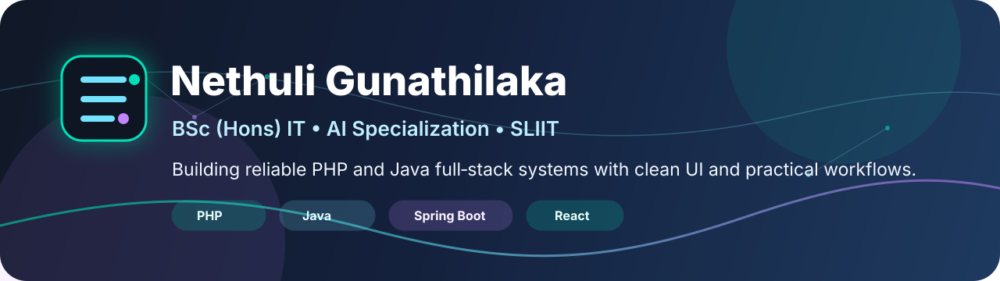
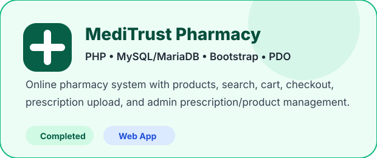
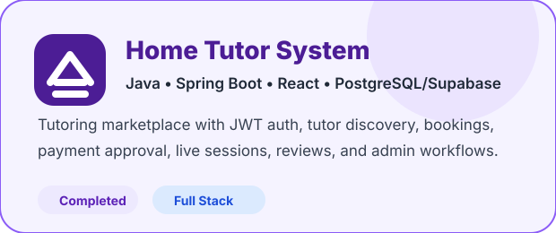
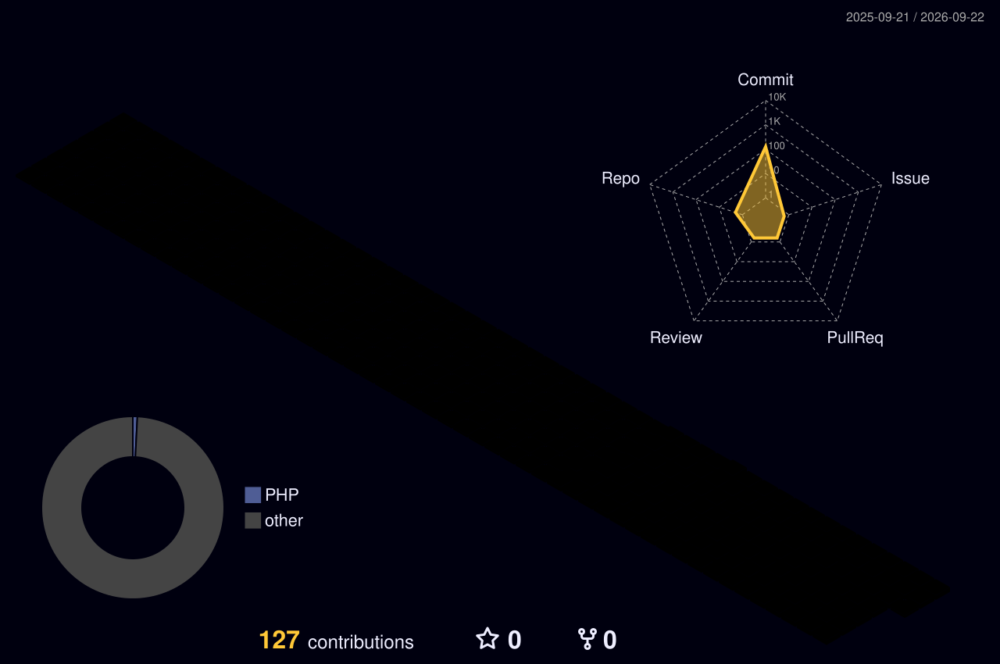

<div align="center">



<br/>

# Hi, I'm Nethuli Gunathilaka

### BSc (Hons) Information Technology Undergraduate at SLIIT  
### Specialization: Artificial Intelligence

I am building a strong software engineering foundation through practical **PHP**, **Java** and database-driven web application projects.

<br/>

[](https://www.linkedin.com/in/nethuli-gunathilaka-a0598221b/)
[](https://github.com/nethuli16)
%20IT-7C3AED?style=for-the-badge)


</div>

---

## 👩‍💻 About Me

- 🎓 Undergraduate at **Sri Lanka Institute of Information Technology (SLIIT)**
- 📚 Degree path: **BSc (Hons) Information Technology — Specialization in Artificial Intelligence**
- 💻 Completed academic projects using **PHP**, **Java**, **Spring Boot**, **React**, and SQL databases
- 🌱 Currently strengthening backend development, full-stack development, database design, and AI fundamentals
- 🎯 Interested in creating clean, useful, and user-friendly software solutions

---

## 🧰 Tech Stack

<div align="center">


</div>

---

## 🚀 Featured Projects

<table>
<tr>
<td width="50%" valign="top">



### 🏥 E-med Pharmacy / MediTrust Pharmacy

A PHP and MySQL/MariaDB online pharmacy web application for medicine browsing, ordering, prescription uploads, and admin-side pharmacy management.

**Project highlights**
- Customer registration and login
- Product catalogue with category filtering and search
- Product details pages
- Session-based cart and checkout flow
- Prescription upload feature
- Admin dashboard for products, inventory, customers, and prescriptions

**Main technologies**  
`PHP` `MySQL/MariaDB` `PDO` `HTML` `CSS` `JavaScript` `Bootstrap`

<br/>

[](https://github.com/nethuli16/E-med-Pharmacy)


</td>
<td width="50%" valign="top">



### 🎓 Home Tutor System

A Java Spring Boot and React full-stack tutoring marketplace for students, tutors, and administrators.

**Project highlights**
- JWT authentication and role-based access
- Student, tutor, and admin workflows
- Tutor discovery and subject filtering
- Booking and availability management
- Payment slip upload and admin approval
- Receipt generation and live session link handling
- Post-lesson reviews and admin moderation

**Main technologies**  
`Java 17` `Spring Boot` `React` `Vite` `PostgreSQL/Supabase` `JWT`

<br/>

[](https://github.com/nethuli16/SE1020-Project-WD.IT.09.174)


</td>
</tr>
</table>

---

## 📌 Project Repository Links

| Project | Type | Repository |
|---|---|---|
| **E-med Pharmacy / MediTrust Pharmacy** | PHP online pharmacy system | [github.com/nethuli16/E-med-Pharmacy](https://github.com/nethuli16/E-med-Pharmacy) |
| **Home Tutor System** | Java Spring Boot + React full-stack tutoring system | [github.com/nethuli16/SE1020-Project-WD.IT.09.174](https://github.com/nethuli16/SE1020-Project-WD.IT.09.174) |

---

## 📚 Current Learning Direction

```text
Backend Development      Java Spring Boot, PHP, REST APIs, authentication
Frontend Development     React, Vite, responsive UI, reusable components
Database Design          MySQL, MariaDB, PostgreSQL, Supabase
Software Engineering     OOP, MVC-style structure, validation, documentation
AI Learning Path         AI fundamentals, Python basics, ML concepts, data handling
```

---

## 📊 GitHub Activity

<div align="center">


<br/><br/>


</div>

---

## 🤖 GitHub Profile Bots

<div align="center">


<br/><br/>



</div>

---

## 🌱 Next Goals

- Improve the UI/UX quality of existing full-stack projects
- Strengthen backend security, validation, and API design
- Build a small AI mini project after strengthening core programming concepts
- Continue improving GitHub documentation and project presentation

---

<div align="center">

### Thanks for visiting my profile ✨


</div>
